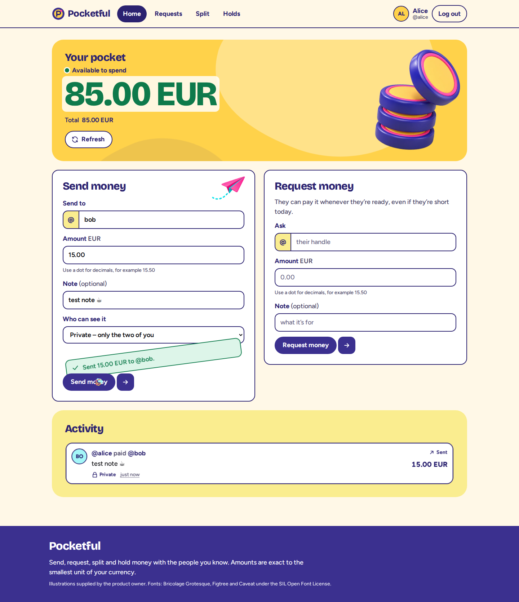
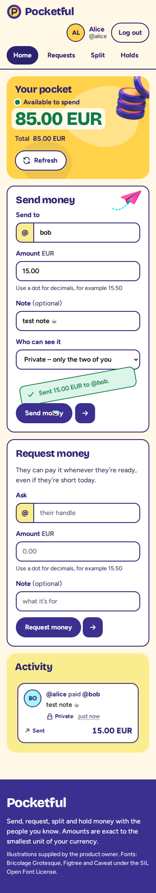

# Twin: the builder never grades its own work

Six seats on three model families built all four Pocketful stages in BAND from one dispatch, with no human message after it.

## Case study at a glance

- **Task.** The pocketful track: four cumulative stages from one dispatch in a fresh BAND room.
- **Band.** 6 seats on 3 model families (Claude, DeepSeek, GPT): auditor (OpenCode), builder (Claude Code), coordinator (Claude Code), gatekeeper (Codex), modeler (Codex), surface (Claude Code).
- **Key design decision.** A seat on a different model family writes an executable model of the written requirements without reading product code, and the gatekeeper accepts a revision only when product and model agree.
- **Verified result.** stage 1 PASS, stage 2 PASS, stage 3 PASS, stage 4 PASS; 12 rejections and 4 acceptances over 331 handoffs. Sealed holdout: 73/73. One rejection came while the organizers' checker passed the same revision 147 of 147; the export it caught answered in 0.011 s after the fix, down from a 10 s timeout.
- **Cost.** BAND attributes 314,436,644 tokens and $204.51 of list-price equivalent to this room (an estimate, not a bill); the auditor's Featherless calls cost $1.03 in Featherless's own billed-request log; see Measured cost and time.
- **Limitation.** Pocketful keeps state in memory, as the track allows, so a restart clears it; the live demo reseeds its accounts.

## What the band built

The stage-4 home screen just after a send, at 1440 px and at 375 px. Both screenshots were taken by the gatekeeper while it checked the accepted revision `a288cc4`; nobody retouched them.

 

## Try it

- Judges, start here: [`JUDGE-GUIDE.md`](JUDGE-GUIDE.md), the run in three minutes, one stop per rubric criterion (Factory, App, Agent Teamwork)
- Live app: https://twin-pocketful-judged-demo.onrender.com/ (free hosting: the first visit after an idle spell can take about a minute while it starts)
- Factory Floor, a replay of the whole room: https://stephensook.github.io/twin-pocketful-judged/
- Demo film, with the Band Desktop room recording: https://youtu.be/f4lin76MaG4
- Demo logins: `ada@demo.example`, `bob@demo.example`, `cleo@demo.example`, `dev@demo.example`, password `pocketful demo`. The demo reseeds every hour.

## How to read this repository

| Path | What it is | Written by (from git) |
|---|---|---|
| `stage-1/` | the stage-1 service: Dockerfile, RUN.md, source, and the checkers' files under verification/ | the band (builder 11, modeler 9, gatekeeper 8, surface 5 commits) |
| `stage-2/` | stage 1 carried forward plus the browser interface and holds, same layout | the band (gatekeeper 7, modeler 6, surface 5, builder 4, auditor 3 commits) |
| `stage-3/` | stage 2 carried forward plus history and corrections, same layout | the band (gatekeeper 14, builder 14, modeler 9, auditor 4, surface 4 commits) |
| `stage-4/` | stage 3 carried forward plus refunds and correction batches: the final service | the band (modeler 4, gatekeeper 3, auditor 3, builder 3, surface 1 commits) |
| `mandates/` | one generic mandate per seat, each starting with its harness and model | the human |
| `room.json` | the BAND room of the judged run, downloaded unchanged | BAND (export committed unchanged by the human) |
| `FACTORY.md` | the factory: seats, design choices and their cost, measured time and spend, how it catches bad work | the human |
| `JUDGE-GUIDE.md` | a three-minute route with one stop per rubric criterion | the human |
| `evidence/` | facts and evidence derived from the room, git and the organizers' checker | the human |
| `tools/` | the scripts that check the room and generate these documents | the human |
| `floor/` | the Factory Floor, a browser replay of the room | the human |
| `deploy/` | the live demo's front door: proxy and hourly reseed around the unchanged stage-4 image | the human |
| `docs/` | the FACTORY.md template | the human |
| `.github/` | CI: the organizers' checker on a fresh clone, the Floor site and the demo image | the human |

## Measured run

- Stages reached: 4 of 4
- Time from dispatch: 3h 21m
- Human messages after dispatch: 0
- Gatekeeper verdicts: 12 REJECT and 4 ACCEPT
- Rejections that ended with a newer writer revision the gatekeeper accepted: 12 of 12
- Rejections with a same-stage writer commit after the REJECT itself: 9 of 12
- Commits to stage folders made by seats: 117 of 117
- Handoffs between seats: 331
- BAND messages retried or undelivered: 0
- Room messages: 5,828 of 10,000
- Sealed holdout the band never saw: 73/73 attacks passed, digest `379f28f6c49b9b99` committed before the dispatch

## Independent checks

The builder and surface write product code. The modeler builds a separate executable reading of the requirements without reading the product. The gatekeeper compares both and is the only seat that accepts a stage. The auditor supplies a third model family's reading.

- Genericity: The same frozen mandates ran the Tablekeeper track twice in fresh rooms and repositories: both times the gatekeeper accepted all four stages, and both times the coordinator posted its stage-4 report after its FINAL REPORT (26 s, then 12 s), so both runs fail the factory's own completion check and are recorded as incomplete.
- Single-agent baseline: One Claude Code agent working alone, dispatched for stage 1 only, passed stage 1: 147 of 147 shipped checks and 16 of 16 sealed attacks; the six-seat factory completed all four stages.
- Refused while the provided checks were green: At 0 h 47 m the gatekeeper rejected stage-1 revision `a7a67ec` while the organizers' checker passed it 147 of 147. Its own probe reset 1,000 accounts in 0.03 s, then the export right after it timed out at 10.01 s, past the spec's 10-second limit. The builder's fix `dadabac` landed 137 s later; at acceptance (`d1ebec2`) a 5,000-account reset took 1.90 s and the export answered in 0.011 s. Evidence: `stage-1/verification/gatekeeper/rejection-a7a67ec.md`.
- Writers and checkers never cross: From git: the gatekeeper, modeler and auditor committed 470 file changes, every one under `stage-N/verification/`; the builder, surface and coordinator committed 207, none there. Check: `git log --author=gatekeeper --name-only --format= | grep -v /verification/` prints nothing.
- The live demo is the graded folder: The live demo runs `ghcr.io/stephensook/twin-pocketful-judged-demo:4c19fe0dab10` (digest `sha256:321d4b48dafc`), built by this repository's demo-image workflow from `stage-4/` at `4c19fe0`; that stage-4 tree (`b88381c62bdf`) is the same tree as at HEAD, so the app you click is the graded folder.
- Provided checks, every stage folder: The organizers' harness, run in isolated mode on a fresh clone at `76795d4`, passes every provided check in every stage folder: 147 of 147 (stage 1), 182 of 182 (stage 2), 188 of 188 (stage 3), 193 of 193 (stage 4). The organizers say these are a portion of the tests applied in judging. Evidence: `evidence/provided-checks.json`.
- Runs without the factory: The app runs on its own: every stage folder is plain Node.js with no npm dependencies, and no stage source file names an outside host, so it never calls BAND, an agent or a model API. The six seats built it; none of them is needed to run it.
- What the provided checks leave out: The organizers ship only part of each Pocketful stage's graded checks: 79% of stage 1, 35% of stage 2, 9% of stage 3, 16% of stage 4 (participant guide at kickoff commit `803560d`); the rest runs only in judging. That gap is what the sealed holdout and the gatekeeper's own probes are for.
- The spec, read twice: The modeler's ledger quotes 513 requirement sentences from the spec (145 from stage 1, 202 stage 2, 112 stage 3, 54 stage 4), each beside the check that would falsify it; the modeler's mandate forbids reading product code. Evidence: `stage-4/verification/ledger.md`.
- Accounts and passwords: Passwords are hashed with Argon2id and compared in constant time; a login for an unknown email still hashes a dummy password, so response time does not reveal which accounts exist. Session tokens are 32 random bytes and the service stores only their SHA-256, so a leaked store holds no usable token. The band wrote all of it (`stage-4/src/passwords.js`, `stage-4/src/store.js`); the public demo's front door also refuses the spec's unauthenticated `/_test` reset and export routes.
- Every stage-2 state, at both widths: The gatekeeper accepted stage 2 (`8038718`, at 1h 49m) with 82 screenshots committed beside the verdict: the same 41 views at 375 px and at 1440 px, covering the empty, loading, filled, refused, held and uncertain states of login, sign-up, home, requests, split and authorizations. 14 minutes earlier it rejected `26581d1` because the phone illustration covered the sign-up heading at 1440 px (`stage-2/verification/gatekeeper/evidence/26581d1-signup-overlap.png`). Browse them in `stage-2/verification/gatekeeper/evidence/8038718/`.

## Evidence

- `room.json`: unchanged BAND export
- `FACTORY.md`: generated run report
- `JUDGE-GUIDE.md`: short route through exact room messages and commits
- `evidence/floor.json`: derived replay data
- `evidence/claim-evidence.json`: verbatim citations for the central factory claims
- `floor/`: browser replay generated from the room export and Git history

## Reproduce

```sh
python3 tools/check_room.py room.json --expected-accepts 4
```
```sh
python3 tools/check_claim_evidence.py room.json evidence/claim-evidence.json
```
```sh
git clone https://github.com/band-ai/dark-factory-wearedevs && cd dark-factory-wearedevs
python3 -m venv .venv && . .venv/bin/activate && python -m pip install -r harness/requirements.txt
python -m harness run --track pocketful --repo <path-to-this-repository> --all --mode isolated
```

## Limits

- Pocketful keeps state in memory, as the track allows, so a restart clears it; the live demo reseeds its accounts.
- Concurrency and history checks are sampled, not proofs.
- Two untracked auditor placeholder files stayed in the build machine's working tree and are not part of this repository.
- The coordinator can post its last stage report after its FINAL REPORT. Both Tablekeeper runs did (26 s, then 12 s), so both fail the factory's own completion check even though every stage was accepted.

Factory source: https://github.com/StephenSook/twin-dark-factory
